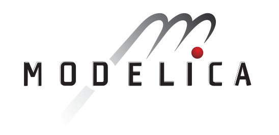

|   |The **14th International Modelica Conference** will be a fully remote and free event, **September 20–24, 2021**. It is organized by [Linköping University](https://liu.se/), in cooperation with the [Modelica Association](https://modelica.org/association).   Join us from the comfort of your own home.|

## UPDATE: The submission deadline has been extended to 10th of May 2021

UPDATE :The conference will be fully online and free and the dates have been extended - September 20-24, 2021

Given the current situation the MA board and the organizers have made the decision to move the conference fully online and extended the dates to September 20-24, 2021.

### Registration page up soon. For sponsorship inquieries see the information on [Other Calls](othercalls.md).

## About the Conference

The Modelica Conference is the main event for users, library developers, tool vendors and language designers to share their knowledge and learn about the latest scientific and industrial progress related to [Modelica](https://modelica.org/), [FMI](https://fmi-standard.org/), [SSP](https://ssp-standard.org/), and [DCP](https://dcp-standard.org/).
The program will cover modeling of complex physical and cyber-physical systems, as well as tools, for a wide range of research and industrial applications.

In addition to paper presentations, the conference features several Modelica tutorials for beginners and advanced users, as well as industrial user presentations, vendor sessions, and an exhibition.
The previous Modelica conference in 2019 in Regensburg, Germany, was attended by more than 400 participants from all over the world, and we would like to welcome even more participants to this conference.

We are looking forward to seeing you.

## Scope of the Conference

[Modelica](https://modelica.org/) is a freely available, equation-based, object-oriented language for convenient and efficient modeling of complex, multi-domain cyber-physical systems described by ordinary differential, difference and algebraic equations. The Modelica language and the companion Modelica Standard Library have been utilized in demanding industrial applications, including full vehicle dynamics, power systems, robotics, hardware-in-the-loop simulations
and embedded control systems. The [Functional Mockup Interface (FMI)](https://www.fmi-standard.org/) is an open standard for the tool-independent exchange of models and for co-simulation. It is supported by many [Modelica and non-Modelica tools](https://modelica.org/tools) and is the key to utilizing Modelica models in non-Modelica environments.

Development in the Modelica Association is organized in [Modelica Association Projects](https://modelica.org/projects):

- LANG - Modelica Language
- LIB - Modelica Libraries
- FMI - Functional Mockup Interface
- SSP - System Structure and Parameterization of Components for Virtual System Design
- DCP - Distributed Co-Simulation Protocol

The projects collaborate to design and maintain a set of coordinated standards for modeling and simulation of complex physical systems.

The Modelica conference will bring together people using Modelica and/or other Modelica Association standards modeling, simulation, and control applications, Modelica language designers, tool vendors and library developers. The Modelica Conference provides Modelica users the opportunity to stay informed about the latest language, library, and tool developments, and to get in touch with people working on similar modeling problems. The conference will cover topics such as the following:
- Multi-engineering modeling and simulation with free and commercial Modelica libraries (mechanics, electrical, hydraulics, thermal, fluid, media, chemical, building, automotive, aircraft, ...)
- Automotive applications
- Thermodynamic and energy systems applications
- Mechatronics and robotics applications
- Medicine and biology applications
- Other industrial applications, such as electric drives, power systems, aerospace, etc.
- Large-scale system modeling
- Real-time and hardware-in-the-loop simulation
- Simulation and code generation for embedded control systems
- Simulation acceleration by use of many CPU cores or GPU cores
- Applications of Modelica for optimization and optimal control
- Modelica modeling, simulation and design tools
- Symbolic algorithms and numerical methods for model transformation and simulation
- Discrete modeling techniques − FEM, CFD, DEM (Discrete Element Method), ...
- New features of the Modelica language and of FMI
- Experimental language designs and implementations related to Modelica
- Modelica in other application areas (mathematical programming, databases etc.)
- Modelica for teaching and education
- FMI in Modelica and non-Modelica applications and tools

## Call for Papers (December 1st  – ~~April 26~~ May 10)

Papers can be submitted for full presentation or for poster presentation. In addition, new free Modelica libraries can be introduced to the public. The Modelica Free Library Award will be given to the best and second best free libraries submitted for review. Modelica Association members (excluding selection committee members) can apply for this award too.

You are encouraged to submit a full paper of 4-10 pages. Please see the [Call-for-Papers page](call2021.md) for further information about the submission and/or application process and the submission templates. All submitted papers will be peer-reviewed by the Conference Program Committee (3 reviews per paper).

The conference proceedings will be published electronically. After the conference, the proceedings will be available online. Authors keep the copyright for their papers and just provide non-exclusive publication rights to the Modelica Association.

## Call for Industrial User Presentations

During the conference two sessions are planned for Industrial User Presentations related to existing and possibly new Modelica Association projects.
You must submit an extended abstract of 1-2 pages for a presentation-only contribution. Please see the Call-for-Papers page for further information about the submission and/or application process. The abstracts will be peer-reviewed by experts, but no papers will be published in the conference proceedings.

Please note that purely tool-related presentations are not permitted for these application-oriented presentations, they should be covered by vendor sessions.

## Call for Tutorials, Vendor Sessions & Sponsors

During the Modelica 2021 Conference tutorials and vendor sessions will be held.

For more information, please check the  [Other Calls](othercalls.md)  page.

Sponsors are also welcome to host virtual exhibition booths - virtual conference/chat rooms that they will set up and staff during conference hours.
Links to these booths will be available via the program page. The vendors are in charge of setting up the booths themselves in the tool of their choice.

We are sure you will be interested in gaining visibility to the Modelica community, especially since this year with free virtual participation we expect a larger attendance than usual.
Therefore we have prepared 2 different Sponsor packages as well as tool vendor sessions and tutorials.

For more information, please check the [Other Calls](othercalls.md) page.

## Important Dates

| | |
|--|--|
| December 1, 2020 | Call for Papers |
|~~April 26, 2021~~|~~Submission of Full Papers and libraries~~|
|May 10, 2021| Extended Deadline for Submission of Full Papers and libraries|
| May 24, 2021 | Notification of Acceptance of Full Papers |
|June 15, 2021| Submission of extended abstracts for Industrial User Presentations|
|August 1, 2021|Submission of final version of Full Papers and libraries,  Applications for Tutorials, Vendor Sessions and Exhibitors|
|September 20-24, 2021|Scientific Program of 14th International Modelica Conference,Tutorials, Industrial User Presentations and Vendor Sessions|

## Registration

Registration is free, but please indicate your interest by registering in advance. This event will be funded by sponsors.
Registration will open soon.

## Conference Timeline

| Day | Morning session |  Afternoon session |
|--|--|--|
|**Monday, September 20, 2021** |Tutorials|Opening session, keynote, paper presentations|
|**Tuesday, September 21, 2021** |Paper presentations|Industrial vendor sessions|
|**Wednesday, September 22, 2021**|Industrial vendor sessions|Paper presentations|
|**Thursday, September 23, 2021**|Paper presentations|Industrial user presentations / FMI User Meeting|
|**Friday, September 24, 2021**|Industrial user presentations|Closing session, keynote, paper presentations|

## Organization and Contact

The conference is organized by Linköping University in cooperation with the [Modelica Association](https://modelica.org/).

**For general questions, please send an email to:** **[modelica2021@groups.liu.se](mailto:modelica2021@groups.liu.se)**

#### Conference chairs:

- Lena Buffoni, Linköping University
- Lennart Ochel, RISE Research Institutes of Sweden AB

#### Program chairs:
- Adrian Pop, Linköping University
- Martin Sjölund, Linköping University

#### Conference Board
Lena Buffoni, Lennart Ochel, Adrian Pop, Martin Sjölund, Francesco Casella, Hilding Elmqvist, Peter Fritzson, Martin Otter, Michael Tiller
