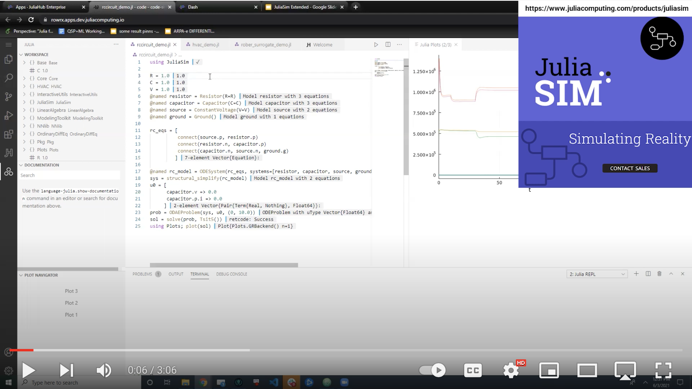

[Julia Computing](http://www.juliacomputing.com/)'s mission is to develop products that bring Julia's superpowers to its customers. Julia Computing's flagship product is [JuliaHub](https://juliahub.com/lp/), a secure, software-as-a-service platform for developing Julia programs, deploying them, and scaling to thousands of nodes. It provides the power of a supercomputer at the fingertips of every data scientist and engineer. In addition to data science workflows, JuliaHub also provides access to cutting-edge products such as [Pumas](https://juliacomputing.com/products/pumas/) for pharmaceutical modeling and simulation, [JuliaSim](https://juliacomputing.com/products/juliasim/) for multi-physics modeling and simulation, and [JuliaSPICE](https://www.youtube.com/watch?v=q8SzFTtgA60) for electronic circuit simulation, combining traditional simulation with modern SciML approaches.

[Julia](http://julialang.org/) is the fastest high performance open source computing language for data, analytics, algorithmic trading, machine learning, artificial intelligence, and other scientific and numeric computing applications. Julia solves the two language problem by combining the ease of use of Python and R with the speed of C++. Julia provides parallel computing capabilities out of the box and unlimited scalability with minimal effort. Julia has been downloaded by users at more than 10,000 companies and is used at more than 1,500 universities. Julia co-creators are the winners of the 2019 James H. Wilkinson Prize for Numerical Software and the 2019 Sidney Fernbach Award. [Julia has run at petascale](https://juliacomputing.com/case-studies/celeste/) on 650,000 cores with 1.3 million threads to analyze over 56 terabytes of data using Cori, one of the ten largest and most powerful supercomputers in the world.

### [Brochure](/Documents/Julia_Computing-JuliaSim.pdf)

 

---

Contacts:

Sushil Kumar <sushil.kumar@juliacomputing.com>

Ravi Madhan <ravi.madhan@juliacomputing.com>

Sanjeeb Das Gupta <Sanjeeb@juliacomputing.com>
